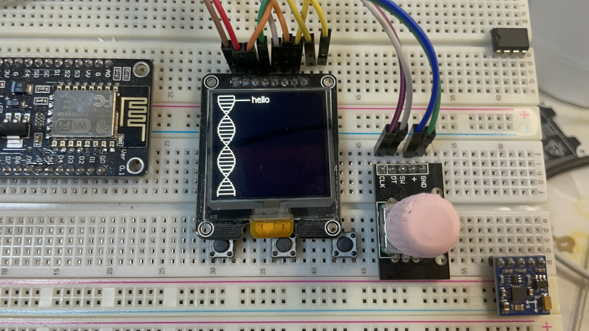

# 在屏幕上绘制类似DNA双螺旋

## 实验所使用硬件

```
    SSD1327 128x128 OLED 模块
    ESP32 DOWDQ5 模块
    EN11 旋转编码器 模块
```

效果图：



通过旋转电位器调整```hello```文字的Y轴位置

## 接线

```
    屏幕SPI：
        CS -> 21
        DC -> 17
        RST -> 16
        SDA -> 23
        SCK -> 18
        VDD -> 3v3
        GND -> GND
    EN11旋转编码器：
        DT -> 26
        CLK ->33
```

## 其他

目前还没想到具体作用🤔

仅仅当作参考使用
